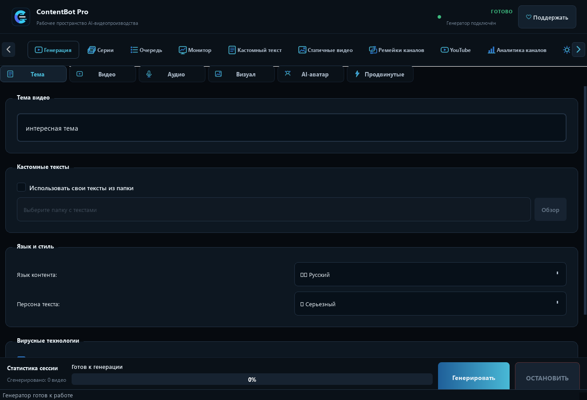
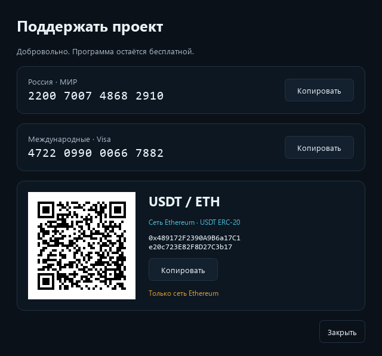

# ContentBot Pro Free

An open-source desktop video generator for Windows. Assemble videos from your
own footage, YouTube and stock media, with voiceover, animated subtitles and a
visual editing interface. No activation key or purchase of the app is required.

[Русская инструкция](docs/README.ru.md) · [Download](https://github.com/antishnaps/shorts-generator/releases) · [GPL 3.0](LICENSE)



## Features

- Local video and image inputs, YouTube, Pexels, Pixabay and Wikimedia Commons.
- Edge TTS or Gemini voiceover, subtitle timing and optional fade/typewriter styles.
- Shot mixing, transitions, visual effects, batches, series and a persistent queue.
- Optional authorization of your own YouTube channels for publishing and analytics.
- Interface in Russian, English, Spanish, French, German, Chinese, Japanese, Korean and Portuguese.

Some workflows require your own API keys. External service quotas, availability
and charges still apply. This is an editing tool, not a guarantee of copyright
clearance, platform approval, audience growth or revenue.

## Run on Windows

1. Install **Python 3.12 x64** from [python.org](https://www.python.org/downloads/).
2. Download and extract the source package from [Releases](https://github.com/antishnaps/shorts-generator/releases).
3. Run `start.bat`. It creates a local virtual environment and installs dependencies from PyPI.
4. Add your own keys for the services you want to use in Settings.

This release is a **source package**, not a standalone `.exe`.
Alternatively, run from a clone:

```powershell
py -3.12 -m venv .venv
.\.venv\Scripts\python.exe -m pip install -r requirements.txt
.\.venv\Scripts\python.exe main.py
```

Verify startup with `main.py --smoke-test`. FFmpeg is available through
imageio-ffmpeg; install full FFmpeg/ffprobe separately for features that need it.
YouTube downloads also need a supported JavaScript runtime such as Node.js or
Deno. Fonts and Vosk speech-recognition models are not bundled.

## External services and privacy

Gemini powers generated text and several AI features. Edge TTS is the default
voice provider. Both need internet access; Gemini, HeyGen and video/image APIs
may incur provider charges. YouTube authorization requires an OAuth client from
your own Google Cloud project. No developer credentials or account access are included.

Use only media you have the right to reuse, and follow source-specific license
and attribution rules. Download access does not grant republication rights.
Content you send to an external API is handled under that provider's terms.

Never commit personal configs, API keys, cookies, OAuth tokens or logs.
The example config starts with empty credentials. Commercial activation code,
sales infrastructure, customer data and the experimental montage lab are not included.

## Optional support

The app remains free. The **Support** button in the header opens receiving details
for Russia/MIR, international/Visa and USDT/ETH on **Ethereum mainnet**.
USDT uses Ethereum ERC-20, not TRON or BNB Smart Chain.
The app does not initiate payments, open a checkout or send payment telemetry.



Receiving details in `assets/support/payment_methods.json` are intentionally public.
They do not contain wallet private keys or card security codes. Verify the address
and network before making a voluntary transfer.

## Development

```powershell
.\.venv\Scripts\python.exe -m pip install -r requirements-dev.txt
.\.venv\Scripts\python.exe -m pytest -q
```

The tests cover subtitles, stock-source clients, YouTube download policy,
settings, the free-edition startup and the donation interface. Network-dependent
generation is not covered by these offline checks.

After changing the receiving wallet address, regenerate its QR with
`python tools/generate_support_qr.py`; the tests check both its contents and
whether it can be scanned at the actual dialog size.

## License

Application source: **GPL-3.0-only**, see [LICENSE](LICENSE).
Dependencies have their own terms, listed in [THIRD_PARTY_NOTICES.md](THIRD_PARTY_NOTICES.md).
Before distributing a binary build, audit the exact bundled dependencies and
provide the required source and notices. The software is provided without warranty.
